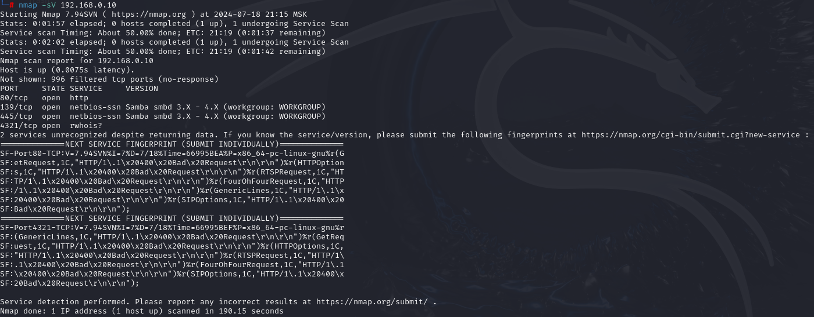

# Домашнее задание к занятию «Уязвимости и атаки на информационные системы» "Макарцев Александр Владимирович"

### Задание 1

Скачайте и установите виртуальную машину Metasploitable: https://sourceforge.net/projects/metasploitable/.

Это типовая ОС для экспериментов в области информационной безопасности, с которой следует начать при анализе уязвимостей.

Просканируйте эту виртуальную машину, используя **nmap**.

Попробуйте найти уязвимости, которым подвержена эта виртуальная машина.

Сами уязвимости можно поискать на сайте https://www.exploit-db.com/.

Для этого нужно в поиске ввести название сетевой службы, обнаруженной на атакуемой машине, и выбрать подходящие по версии уязвимости.

Ответьте на следующие вопросы:

- Какие сетевые службы в ней разрешены?
- Какие уязвимости были вами обнаружены? (список со ссылками: достаточно трёх уязвимостей)
  
*Приведите ответ в свободной форме.*  

#### Решение

Samba 3.5.0 < 4.4.14/4.5.10/4.6.4 - 'is_known_pipename()' Arbitrary Module Load (Metasploit) https://www.exploit-db.com/exploits/42084

Samba 3.4.16/3.5.14/3.6.4 - SetInformationPolicy AuditEventsInfo Heap Overflow (Metasploit) https://www.exploit-db.com/exploits/21850

Linux Kernel 2.6.9 < 2.6.25 (RHEL 4) - utrace and ptrace Local Denial of Service (1) https://www.exploit-db.com/exploits/31965

### Задание 2

Проведите сканирование Metasploitable в режимах SYN, FIN, Xmas, UDP.

Запишите сеансы сканирования в Wireshark.

Ответьте на следующие вопросы:

- Чем отличаются эти режимы сканирования с точки зрения сетевого трафика?
- Как отвечает сервер?

*Приведите ответ в свободной форме.*

#### Решение

- SYN: отправляются SYN пакеты на все сканируемые порты. Открытые порты отвечают пакетом SYN ACK, закрытые порты отвечают RST ACK;
- FIN: отправляются FIN пакеты на все сканируемые порты. Закрытые порты отвечают RST. Остальные молчат;
- Xmas: отправляются пакеты c флагами FIN, PSH и URG на все сканируемые порты. Закрытые порты отвечают RST ACK. Остальные молчат;
- UDP: отправляются UDP пакеты. Для большинства портов пустые, но для некоторых популярных отправляется специфический для протокола payload. Дальше состояние порта определяется по наличию/отсутствию ответа UDP или ICNP.